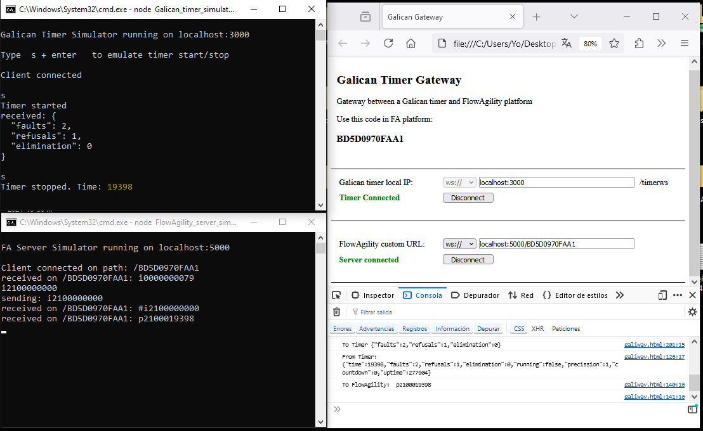

# GALIGATEWAY

A standalone HTML file to act as a gateway between a Galican Timer and the FlowAgility platform.

## Usage
1. Connect your laptop **to the Galican Timer over WiFi** and **to the internet over Ethernet**.
2. Run the HTML file on your favourite browser in your laptop.
3. Enter the Galican Timer IP address and connect.
4. Enter the generated MAC address on the FlowAgility platform in the relevant section to connect the timers, then press "Connect."
5. Copy the URL provided by the FlowAgility platform.
6. Enter the URL in the HTML interface and press "Connect."

## Capabilities
Currently, only faults, refusals, eliminations, timing, and reset functions are supported.
- Timer times will be sent to the FlowAgility platform at each timer start and stop.
- Faults, refusals, eliminations, and resets will be sent to the timer for each occurrence in FlowAgility.

## Simulation
A timer simulator and a FlowAgility server simulator are provided for testing purposes.
- **Requirements:** Node.js 18 or higher

1. Unzip the folder and open a terminal in the unzipped folder.

2. Install dependencies:
```bash
    npm i
```

3. Run the HTML file on your favourite browser in your laptop.

4. Run the FA server simulator:
```bash
    node FlowAgility_server_simulator.js
```

5. In a separate terminal within the unzipped folder, run the Galican Timer simulator:

```bash
    node Galican_timer_simulator.js
```

6. In the Galican Timer simulator, press `s` + `Enter` to simulate starting or stopping the timer.  
7. In the FA server simulator, type an 11-symbol telegram format + `Enter` to send faults, refusals, and eliminations, for example:
- `i3210000000` sends 3 faults, 2 refusals, and 1 elimination.
- `p0000000000` sends a reset.

Example of simulation done in Windows 10:


## Notes
Learn more about the 11-symbol telegram format at: [11-symbol telegram documentation](https://github.com/ZonEcron/ZonEcron-Interfacing/blob/main/WebsocketServer.md#3-message-diagram)
